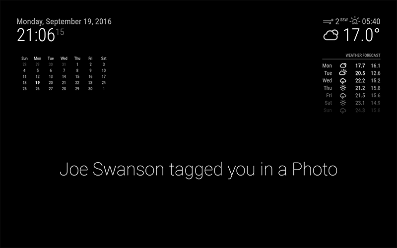

# MMM-IFTTT
[MagicMirror](https://magicmirror.builders/) Module for [IFTTT Maker](https://ifttt.com/maker) Web Based Notifications



This module is intended to display immediate notifications of events from If-This-Then-That channels.
Notifications will show for a default of 60 seconds before disappearing. There is no on-screen history
of events.


## Module installation

Clone the module and npm install:

```bash
cd ~/MagicMirror/modules
git clone https://github.com/jc21/MMM-IFTTT.git
cd MMM-IFTTT
npm install
```

Add the module config to `~/MagicMirror/config/config.js`

```javascript
modules: [
    {
        module: 'MMM-IFTTT',
        position: 'lower_third',
        config: {

        }
    }
]
```


## Module Configuration Options

<table width="100%">
    <thead>
        <tr>
            <th>Option</th>
            <th>Type</th>
            <th>Default</th>
            <th width="100%">Description</th>
        </tr>
    <thead>
    <tbody>
        <tr>
            <td><code>displaySeconds</code></td>
            <td>Integer</td>
            <td><code>60</code></td>
            <td>Number of seconds to show a notification for</td>
        </tr>
        <tr>
            <td><code>fadeSpeed</code></td>
            <td>Integer</td>
            <td><code>3000</code></td>
            <td>Milliseconds fade transition speed</td>
        </tr>
        <tr>
            <td><code>size</code></td>
            <td>String</td>
            <td><code>large</code></td>
            <td>Text size, options are: small, medium, large, xlarge</td>
        </tr>
    </tbody>
</table>


## Setting up a IFTTT Maker Notification

### Making your mirror internet accessible

For this module to work, you will need to get dirty with your router, specifically with Port Forwarding.

I'm not going to go into detail here, there are plenty of [Google results](https://www.google.com.au/?gws_rd=ssl#q=router+port+forwarding)
 on the topic.

You will need to forward any port you nominate, to the local IP of your Magic Mirror on port 8080.

You will also need to set up a dynamic DNS hostname for your home network, I'm a [Duckdns](https://www.duckdns.org/)
 fan personally. Atlernatively you could look into a http forward solution like [ngrok](https://ngrok.com/). 


### IFTTT Maker Recipes

Log in to [IFTTT](https://ifttt.com/) and create a new recipe. You can essentially choose any channel
 you want for the Trigger but for the Action channel you must select Maker.

There is only one Action, "Make a web request".

Action fields explained:

<table width="100%">
    <thead>
        <tr>
            <th>Field</th>
            <th>Description</th>
            <th>Example</th>
        </tr>
    <thead>
    <tbody>
        <tr>
            <td>URL</td>
            <td>Notification endpoint</td>
            <td>http://yourhouse.duckdns.org:8080/IFTTT</td>
        </tr>
        <tr>
            <td>Method</td>
            <td>HTTP Method, MUST be POST</td>
            <td>POST</td>
        </tr>
        <tr>
            <td>Content Type</td>
            <td>How the data is sent</td>
            <td>application/json</td>
        </tr>
        <tr>
            <td>Body</td>
            <td>The notification content, explained below</td>
            <td><pre><code>{
    "message": "<<<{{From}}>>> tagged you in a Photo",
    "displaySeconds": 45,
    "size": "large"
}</code></pre></td>
        </tr>
    </tbody>
</table>

The notification body JSON MUST contain the `message` item. If it doesn't, the endpoint will return a 400 error.
 All of the configuration options can also be passed with the JSON, which will override the config for
 that recipe only.

The `<<<{{From}}>>>` in the example above is a IFTTT wildcard field that you select in the Body section
 of the action. You can create any message you like that incorporates any wildcard. Stay away from fields that may
 contain HTML or links, they won't display well. These fields should be surrounded in `<<<` and `>>>` strings in
 order for the field to be escaped properly.

## Using additional modules

This module will send out notifications to other supported modules, if those options are included in the notification JSON.
The supported modules are:

#### [MMM-Pir-Sensor](https://github.com/paviro/MMM-PIR-Sensor)

IFTTT Module will automatically tell the Pir Sensor module to wakeup the monitor when a notification is received. No addition setup is required.


#### [MMM-PiLights](https://github.com/jc21/MMM-PiLights)

This additional module can display light sequences using a LED strip. An example of a notification that includes PiLights sequence:

```json
{
    "message": "<<<{{From}}>>> tagged you in a Photo",
    "displaySeconds": 45,
    "size": "large",
    "pilights": "blue-pulse"
}
```

Or with iterations:

```json
{
    "message": "<<<{{From}}>>> tagged you in a Photo",
    "displaySeconds": 45,
    "size": "large",
    "pilights": {
        "sequence": "blue-pulse",
        "iterations": 2
    }
}
```


#### [MMM-Sounds](https://github.com/jc21/MMM-Sounds)

This additional module can play audio sounds if your mirror supports it. An example of a notification that would play a Sound:

```json
{
    "message": "<<<{{From}}>>> tagged you in a Photo",
    "displaySeconds": 45,
    "size": "large",
    "sound": "wobble.wav"
}
```

Or with a delay:

```json
{
    "message": "<<<{{From}}>>> tagged you in a Photo",
    "displaySeconds": 45,
    "size": "large",
    "sound": {
        "sound": "wobble.wav",
        "delay": 1000
    }
}
```

You may want to use the delay approach to manually align the sound you're using with the light sequence, or to time the wakeup of the screen as well.


## Testing the Mirror Endpoint

```bash
curl -X POST -H "Content-Type: application/json" \
    -d '{"message": "Your pizza is ready!"}' \
    "http://yourhouse.duckdns.org:8080/IFTTT"
```
